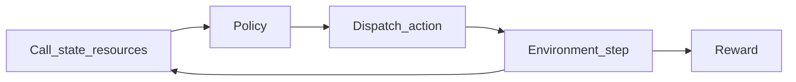

# From 911 Calls to Policy Gradients: Reinforcement Learning for Public Safety Dispatch

When a 911 center routes the wrong help, the cost is not a bad ad click it is time, trust, and lives. **Reinforcement learning (RL)** studies that problem systematically: a **policy** maps **states** to **actions** and improves from **feedback** without hand-coding every edge. Here is how that maps to **emergency dispatch** (ambulance, **police**, **fire**), and where simulators, **reward** design, and real limits bite.

## Why emergency dispatch is an RL problem

Dispatch is not a single guess; it is a **sequence of choices under a budget**. You have finite crews and vehicles, calls arrive over time, and every assignment changes what is left for the next incident. The “right” move balances **coverage**, **urgency**, and **correct unit types**: sending an ambulance to a structure fire or ignoring backup on a fast-escalating scene can each fail a community in different ways.

The analogy is **traffic routing** at city scale, except the flow is **multi-service** first responders. That loop—**state, action, reward, next state**—is a **Markov decision process**; **911 dispatch simulations** use it with a **reward** that encodes public-safety goals.

## RL in one screen: state, action, policy, reward

In RL, the **agent** (a **dispatcher policy**) picks an **action** from a **state**; the **environment** returns **reward** and the next state. The policy can be a network, rules, or a text-conditioned model.

In this project’s **Emergency Response Dispatch System**, the observation includes **call text**, **severity**, **episode progress**, and **available resources**; the agent outputs per-type unit counts, **priority**, and **backup**, scored by a **rubric** against a reference dispatch.

The action is structured by design—not one vague “help level,” but per-service counts. For example, the Pydantic `DispatchGridAction` model in this codebase captures that shape:

```python
class DispatchGridAction(Action):
    ambulance_units: int  # 0 = not sent; validated 0–10 in env
    police_units: int
    fire_units: int
    priority_level: int   # 1=low .. 4=critical
    backup_requested: bool
```

**Observations** include the current call, running totals, and remaining ambulances, police, and fire so the policy cannot ignore depletion. That is how “finite resources” becomes part of the **state** instead of a footnote.



### How police, ambulance, and fire show up in the same policy

A useful simulator labels each scenario with a **ground-truth** mix of services—e.g. `correct_dispatch: {"ambulance": 1, "police": 0, "fire": 0}` for a clear medical call, or more police and fire when the narrative implies crime plus hazard. **Easy** task profiles use single-type incidents; **harder** ones blend ambiguity and **multi-hazard** language so a single “send everything” guess wastes resources or misses nuance.

In the field, **medical** calls lean **EMS**; **structural fire** leans **fire**; **in-progress violence** leans **police** (sometimes plus EMS). The RL target is the right *types* and *counts* from language—not a “speed” score with the wrong truck.

## Simulation before the street

You cannot A/B test on live 911 like a website. A **simulator** gives **safety**, **repeatability**, and **ablations** (call mix, resource caps, difficulty). **OpenEnv**-style `reset` / `step` over HTTP (notebook or **Hugging Face Space**) unifies **training** and **baselines**.

Here, **Unsloth** + **Hugging Face TRL** + **GRPO** updates the policy from **on-policy** rollouts where **reward comes from the simulator**; a local in-process server keeps **Colab** from paying WAN latency on every `step`—**environment-grounded** learning, not a static CSV.

## Challenges and limitations

**Reward design** is the first hard problem. A naive reward can be **gamed**: send unnecessary units, exploit loopholes, or over-weight easy targets. Mature simulators add **caps**, **penalties** for over-dispatch, and checks so “cheating the rubric” does not look like public safety. **Distribution shift** is the next: a policy trained on one city’s or one simulator’s call mix can fail when call wording, traffic, or hospital capacity **differs in production**.

Real **911** logs are **incomplete** and **biased** (they reflect what humans did). **Governance** matters: stay **subordinate to human authority**, with audits and **fallbacks**. Use RL to **stress-test** in sim—not as a direct deploy lever.

## Actionable takeaways

- **Define the simulator contract first**: observation fields, action legality, reward definition, and episode boundaries—before touching model code.
- **Log episode returns and compare baselines** (e.g. random or scripted) against trained policies; improvement should show up in aggregate metrics, not one cherry-picked trace.
- **Model dispatch as structured actions** (per-service units, priority, backup) so learning targets match operational reality.
- **Plan for human-in-the-loop evaluation** on held-out or adversarially worded calls before any operational talk.
- **Invest in reward hygiene**: discourage over-dispatch and reward hacking early so the policy optimizes the behavior you mean.

**Closing thought:** Reinforcement learning gives emergency services a **repeatable decision lab**—a place to test allocation under stress with explicit metrics. It is not, by itself, a substitute for **policy, oversight, and trust**; it is a way to make those things **evidence-based**.

## FAQ

**Is the goal to replace human dispatchers?**  
No serious framing should. The useful goal is **decision support**, training simulators, and **offline** evaluation of allocation ideas—always with human accountability.

**What is GRPO in this context?**  
**GRPO** (Group Relative Policy Optimization) with **TRL** compares trajectory groups; higher **simulator** return steers the update—treating the env as the judge.

**Why not only supervised learning on historical dispatch logs?**  
Logs show what *was* done, not a full picture of *counterfactual* outcomes, and they inherit human bias. RL in a **simulator** can optimize under explicit objectives and **counterfactual** actions, at the cost of sim-to-real **gap**—hence the emphasis on **honest** reward design and **limits**.

**What about live deployment?**  
Treat any move toward production as a **governance and safety** program first: data rights, **audit trails**, **fallback** to human dispatch, and continuous monitoring—not only model accuracy.

---


*Links: [Hackathon build story](https://github.com/Ignatius-Nobel/Emergency-Dispatch-System/blob/main/README.md) · [Repo](https://github.com/Ignatius-Nobel/Emergency-Dispatch-System) · [Hugging Face Space](https://huggingface.co/spaces/ignatius-nobel/Emergency-Dispatch-System)*
